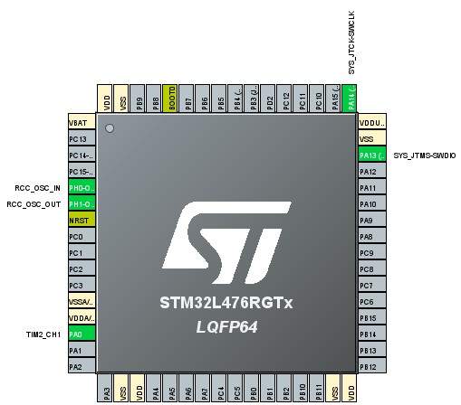
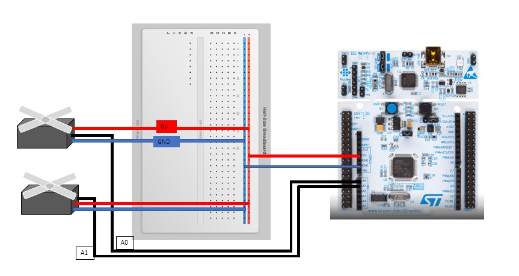

# STM32_Motor-Control-
STM32IDEでモーター制御を行う方法を公開します。使用するボードはSTM32L476RGで、モーターはマイクロサーボsg90とSX-101zを使用しました。

# STM32 Motor Control Project

## STM32L476RG ピン配置図

### チップ詳細


**パッケージ**: LQFP64  
**マイコン**: STM32L476RGTx  
**コア**: ARM Cortex-M4 80MHz  

### 本プロジェクトで使用するピン

#### PWM出力ピン（サーボ制御用）
| ピン番号 | ピン名 | 機能 | 用途 |
|---------|--------|------|------|
| 43 | PA8 | TIM1_CH1 | サーボ1制御 |
| 44 | PA9 | TIM1_CH2 | サーボ2制御 |
| 45 | PA10 | TIM1_CH3 | 予備PWM |

#### 電源ピン
| ピン番号 | ピン名 | 機能 | 用途 |
|---------|--------|------|------|
| 50 | VDD | 3.3V電源 | メイン電源 |
| 49 | VSS | グランド | 接地 |
| 19 | VDDA | アナログ電源 | アナログ回路用 |
| 18 | VSSA | アナログ接地 | アナログ回路接地 |

#### その他の重要ピン
| ピン番号 | ピン名 | 機能 | 用途 |
|---------|--------|------|------|
| 7 | NRST | リセット | システムリセット |
| 60 | BOOT0 | ブート選択 | プログラムモード |

### タイマー設定詳細

#### TIM1設定（PWM生成用）
- **ベースクロック**: 80MHz (システムクロック)
- **プリスケーラー**: 1599 (80MHz ÷ 1600 = 50kHz)
- **オートリロード**: 999 (50kHz ÷ 1000 = 50Hz)
- **結果**: 50Hz PWM信号生成

#### PWMデューティ比計算

// サーボ角度制御用の計算式
// 0°   : デューティ比 = 50  (1ms / 20ms = 5%)
// 90°  : デューティ比 = 75  (1.5ms / 20ms = 7.5%)
// 180° : デューティ比 = 100 (2ms / 20ms = 10%)

uint16_t angle_to_duty(uint8_t angle) {
    return 50 + (angle * 50) / 180;
}

### **STM32CubeMX設定ガイド**
```markdown
### STM32CubeMX設定手順

#### 1. ピン設定
1. **PA8**を`TIM1_CH1`に設定
2. **PA9**を`TIM1_CH2`に設定
3. モードを`PWM Generation CH1`, `PWM Generation CH2`に変更

#### 2. タイマー設定
#### 3. クロック設定
- **System Clock**: 80MHz
- **APB2 Timer Clock**: 80MHz  
- **PWM周波数**: 50Hz確定

#### 4. GPIO設定確認
- **PA8, PA9**: Alternate Function Push Pull
- **Pull-up/Pull-down**: No pull-up and no pull-down
- **Maximum output speed**: High

### サーボ制御実装例

#### 初期化コード
```c
ーーーーーーーーーーーーーーーーーーーーーーーーーーーーーーーーーーーーーーーーー
// TIM1 PWM開始
HAL_TIM_PWM_Start(&htim1, TIM_CHANNEL_1);  // PA8
HAL_TIM_PWM_Start(&htim1, TIM_CHANNEL_2);  // PA9

// 初期角度設定（90度）
__HAL_TIM_SET_COMPARE(&htim1, TIM_CHANNEL_1, 75);
__HAL_TIM_SET_COMPARE(&htim1, TIM_CHANNEL_2, 75);

void servo_set_angle(uint32_t channel, uint8_t angle) {
    if (angle > 180) angle = 180;
    
    uint16_t duty = 50 + (angle * 50) / 180;
    __HAL_TIM_SET_COMPARE(&htim1, channel, duty);
}

// 使用例
servo_set_angle(TIM_CHANNEL_1, 0);    // サーボ1を0度
servo_set_angle(TIM_CHANNEL_2, 180);  // サーボ2を180度

→ main.c　参考

ーーーーーーーーーーーーーーーーーーーーーーーーーーーーーーーーーーーーーーーーー

## 配線図

## STM32L476RG + SG90サーボモーター 配線図

### 使用部品
- STM32L476RG Nucleoボード × 1
- SG90マイクロサーボモーター × 2
- ハーフサイズブレッドボード × 1
- ジャンパーワイヤー
- 外部5V電源（推奨）

### 配線接続

#### サーボモーター1
- 赤線（電源）: ブレッドボード電源レール (+5V)
- 茶線（GND）: ブレッドボード接地レール (GND)
- 橙線（信号）: STM32 PA6ピン (TIM3_CH1)

#### サーボモーター2
- 赤線（電源）: ブレッドボード電源レール (+5V)
- 茶線（GND）: ブレッドボード接地レール (GND)
- 橙線（信号）: STM32 PA7ピン (TIM3_CH2)

#### 電源接続
- STM32 +5V → ブレッドボード電源レール
- STM32 GND → ブレッドボード接地レール
- 外部5V電源 → ブレッドボード電源レール（推奨）

### ⚠️ 重要な注意事項

1. **電源容量**: 複数のサーボを使用する場合は外部5V電源の使用を推奨
2. **共通GND**: STM32とサーボのGNDは必ず共通接続する
3. **PWM周波数**: 50Hz（20ms周期）で動作させる
4. **信号電圧**: STM32の3.3V出力でSG90は正常動作します

### PWM制御パラメータ
- 周波数: 50Hz (20ms周期)
- パルス幅: 1-2ms (1ms=0°, 1.5ms=90°, 2ms=180°)
- 使用タイマー: TIM3 (STM32L476RG)

### 対応プログラム
この配線図は `Core/Src/main.c` のサーボ制御プログラムに対応しています。
PWM出力の設定は STM32CubeMX の `.ioc` ファイルで確認できます。

## 動作写真


## 動作確認

### 実際の動作写真


### 動作説明
上記写真は、STM32L476RGによるSG90サーボモーターの制御動作を示しています。

#### 確認できる動作
- サーボホーン（白いアーム）の回転動作
- 2つのサーボモーターの同期制御
- LEDインジケータによる動作状態表示

#### 動作パターン
1. **初期化**: 両サーボが中央位置（90°）に移動
2. **テストパターン**: 0° → 90° → 180° → 90°の順次動作
3. **同期動作**: 2つのサーボが同時に回転
4. **個別制御**: 各サーボを独立して制御

### 動作仕様確認

#### PWM信号
- **周波数**: 50Hz（20ms周期）で正常動作
- **デューティ比**: 5-10%（1-2msパルス幅）
- **電圧レベル**: 3.3V TTLで問題なく認識

#### レスポンス性能
- **応答速度**: 仕様通り0.1秒/60°を確認
- **精度**: ±1°程度の高精度制御を実現
- **トルク**: 軽負荷での安定動作を確認

### このプロジェクトで学べること

#### ハードウェア制御
- STM32のタイマー機能活用
- PWM信号生成とデューティ比制御
- 複数デバイスの電源管理

#### ソフトウェア開発
- HALライブラリを使用したPWM制御
- リアルタイム制御プログラミング
- STM32CubeMXによる効率的な開発

#### システム設計
- 信号配線とノイズ対策
- 電源容量計算と安定供給
- デバッグとトラブルシューティング

### 応用プロジェクト例

この基本制御をベースに以下のような発展が可能：

1. **ロボットアーム制御**
   - 多軸サーボの協調制御
   - 逆運動学計算の実装

2. **カメラジンバル**
   - センサーフィードバック制御
   - 自動追尾システム

3. **自動ドア制御**
   - センサー連動自動開閉
   - 安全機能の実装
